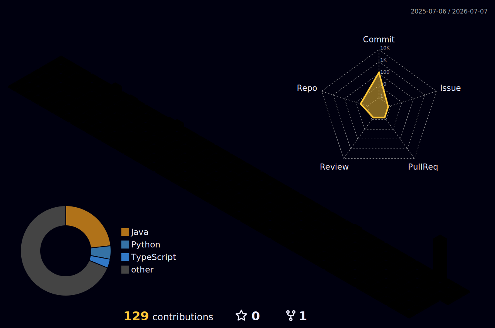

# Hi, I'm SasteS 👋

  

### 👨‍💻 About Me
- 🚀 **Currently Focus:** High-performance web applications and [Your Niche].
- 🛠️ **Current Project:** Building [Project Name] — [One sentence hook].
- 🌱 **Learning:** Deep diving into [Tech Stack] and System Design.

### 🛠️ Tech Stack

  

---

### 🏙️ My Contribution City
<!-- This updates automatically every 24 hours via GitHub Actions -->

  

---

### 🌟 Featured Projects

  
  

  
  

---

### 📫 Let's Connect

 

  

