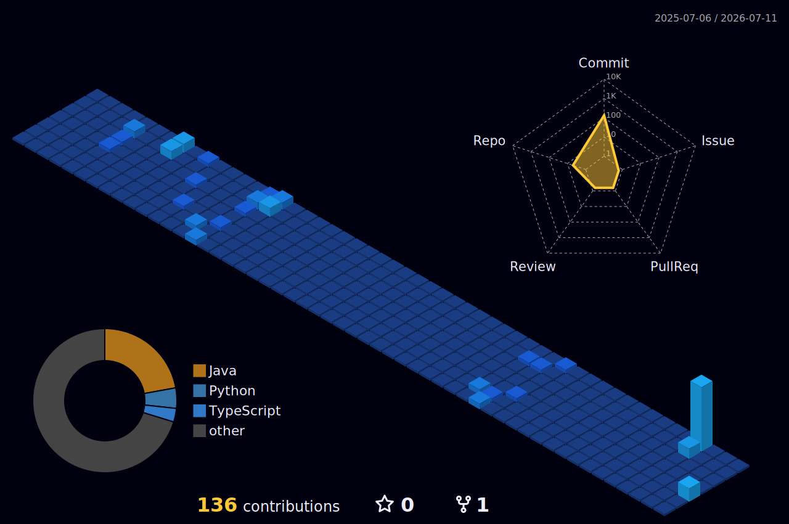

  
   
  

### 🏭 Bridging IT & OT (Operational Technology)
I am a Software Engineer focused on the intersection of modern software architectures and industrial automation. Specializing in machine fault prediction and Cyber-Physical Systems.

---

### 🛠️ Expertise & Technical Stack

  <b>Languages:</b> 
  

  <b>Frameworks:</b> 
  

  <b>Infrastructure:</b> 
  

---

### 🌟 Featured Projects
<!-- NO TABLES = NO GRIDLINES. Compact layout = Identical dimensions -->

  
  

  
  

---

### 🏙️ My Code City

  

---

### 🤝 Connect with me

  
  &nbsp;&nbsp;
  

  

